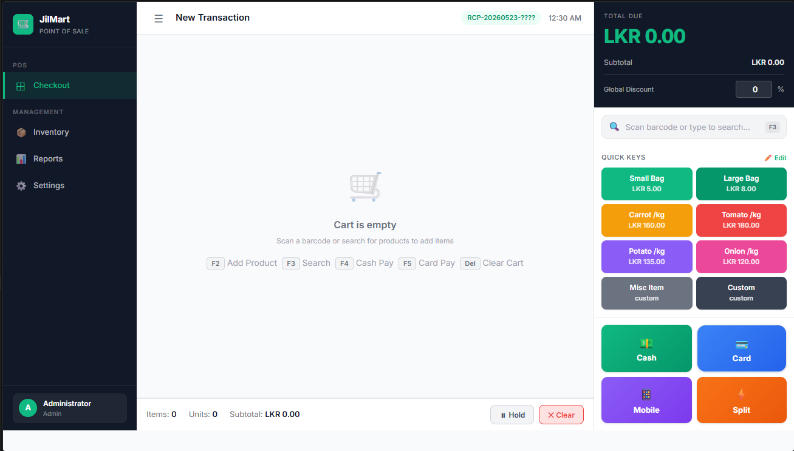

# 🛒 JilMart Supermarket POS System

A high-performance, full-featured **Point of Sale system** built for JilMart Supermarket. Designed for fast retail checkout workflows with real-time inventory management, barcode scanner integration, multi-payment support, and a clean modern UI.


---

## 📸 Screenshots

### Checkout Screen


> **3-panel layout** — Left: navigation sidebar with cashier info · Center: live cart table · Right: total, product search, quick keys, and payment buttons

| Sales Reports | Inventory Management |
|---|---|
| Daily/Weekly/Monthly charts (Chart.js) | Product CRUD with low stock alerts |

---

## ✨ Features

### 🖥️ Checkout (Main POS)
- **3-panel layout** — Sidebar nav / Active cart / Total + payment panel
- **Barcode scanner** — Plug-and-play HID keyboard scanner support (instant product lookup)
- **Live product search** — Debounced search by name or barcode with dropdown results
- **Cart management** — Add, remove, adjust quantities, per-item discounts
- **Global discount** — Apply % discount across the whole transaction
- **Quick Keys panel** — Configurable buttons for common items (produce, bags, etc.)
- **Receipt generation** — Monospace receipt formatted for 80mm thermal printers

### 💳 Payment Methods
| Method | Features |
|--------|----------|
| 💵 **Cash** | Quick-amount presets, automatic change calculation |
| 💳 **Card** | Approval/reference code entry |
| 📱 **Mobile Pay** | Reference number tracking |
| ⚡ **Split** | Combine any mix of Cash + Card + Mobile |

### 📦 Inventory Management
- Full product CRUD (Create, Read, Update, Delete)
- Barcode assignment with auto-generate option
- Category, unit, cost/retail price, low-stock threshold
- **Profit margin** display per product
- Stock adjustment (+/−) with reason tracking
- **Low stock alerts** — banner warning on checkout screen
- CSV export of full inventory

### 📊 Sales Reports
- **Dashboard** — Today's revenue, transaction count, avg sale, low stock count
- **Daily** — Hourly revenue chart, payment method breakdown (doughnut), top products
- **Weekly** — 7-day revenue line chart
- **Monthly** — Bar chart with revenue vs. discounts, daily breakdown table
- **Top Products** — By revenue with date range filter
- **Transaction History** — Full searchable log with detail view

### ⚙️ Settings
- Store name, address, phone, email
- Cashier management (add/edit/deactivate, role-based: cashier/supervisor/admin)
- Quick Keys editor (name, price, color)
- Receipt footer message, printer width configuration
- Live receipt preview

---

## 🚀 Getting Started

### Prerequisites
- [Node.js](https://nodejs.org/) v18 or higher
- npm (comes with Node.js)

### Installation

```bash
# 1. Clone the repository
git clone https://github.com/your-username/jilmart-pos.git
cd jilmart-pos

# 2. Install dependencies
npm install

# 3. Start the server
npm start
```

Open your browser at **http://localhost:3000**

> For development with auto-reload:
> ```bash
> npm run dev
> ```

The SQLite database (`database/jilmart.db`) is created automatically on first run with **41 sample products** and **3 default cashiers**.

---

## 🔑 Default Login PINs

| Cashier | Username | PIN | Role |
|---------|----------|-----|------|
| Administrator | admin | `1234` | Admin |
| John Silva | john | `1111` | Cashier |
| Mary Fernando | mary | `2222` | Cashier |

> **Change PINs** via **Settings → Cashiers** after first login.

---

## ⌨️ Keyboard Shortcuts

| Key | Action |
|-----|--------|
| `F1` | Toggle sidebar |
| `F2` | Add new product (quick entry) |
| `F3` | Focus search / barcode input |
| `F4` | Open Cash payment |
| `F5` | Open Card payment |
| `F6` | Open Mobile payment |
| `F7` | Open Split payment |
| `Delete` | Clear cart |
| `Escape` | Close modal / clear search |

---

## 📁 Project Structure

```
jilmart-pos/
├── server.js                   # Express entry point (port 3000)
├── .env                        # Environment config (PORT)
├── package.json
│
├── database/
│   └── db.js                   # SQLite schema, seed data, connection
│
├── routes/
│   ├── products.js             # Product CRUD + barcode/search API
│   ├── transactions.js         # Transaction creation + stock deduction
│   ├── reports.js              # Dashboard, daily/weekly/monthly analytics
│   └── inventory.js            # Cashiers, stock adjust, quick keys, settings
│
└── public/
    ├── index.html              # Checkout screen
    ├── inventory.html          # Inventory management
    ├── reports.html            # Sales reports
    ├── settings.html           # System settings
    ├── css/
    │   └── main.css            # Full design system (CSS variables, layout)
    └── js/
        ├── app.js              # Shared: API wrapper, auth, toasts, modals
        ├── checkout.js         # Cart, barcode scanner, payments, receipt
        ├── inventory.js        # Product CRUD, stock adjust, CSV export
        ├── reports.js          # Charts + report tables
        └── settings.js         # Settings, cashier & quick-key management
```

---

## 🗄️ Database Schema

```sql
cashiers          — id, name, username, pin, role, is_active
products          — id, barcode, name, category, cost_price, retail_price,
                    stock_quantity, low_stock_threshold, unit, is_active
quick_keys        — id, product_id, name, price, color, position
transactions      — id, receipt_number, subtotal, discount_applied,
                    total_amount, payment_method, cash_given, change_given,
                    card_amount, mobile_amount, cashier_id, created_at
transaction_items — id, transaction_id, product_id, quantity,
                    price_at_sale, discount_amount
settings          — key, value
```

---

## 🎨 Design System

| Token | Value | Usage |
|-------|-------|-------|
| `--primary` | `#10B981` | Emerald green — active states, totals |
| `--bg` | `#F9FAFB` | Soft off-white background |
| `--surface` | `#FFFFFF` | Panel backgrounds |
| `--text` | `#111827` | Deep charcoal text |
| Font | Inter / Segoe UI | Clean sans-serif |

---

## 🔌 API Endpoints

### Products
| Method | Endpoint | Description |
|--------|----------|-------------|
| `GET` | `/api/products` | List all products (supports `?search=`, `?category=`, `?lowstock=1`) |
| `GET` | `/api/products/search?q=` | Live search (max 12 results) |
| `GET` | `/api/products/barcode/:barcode` | Exact barcode lookup |
| `POST` | `/api/products` | Create product |
| `PUT` | `/api/products/:id` | Update product |
| `DELETE` | `/api/products/:id` | Soft delete |

### Transactions
| Method | Endpoint | Description |
|--------|----------|-------------|
| `POST` | `/api/transactions` | Create transaction (atomic, updates stock) |
| `GET` | `/api/transactions` | List transactions (`?date=`, `?cashier_id=`) |
| `GET` | `/api/transactions/:id` | Get transaction with all items |

### Reports
| Method | Endpoint | Description |
|--------|----------|-------------|
| `GET` | `/api/reports/dashboard` | Today summary + low stock count |
| `GET` | `/api/reports/daily?date=` | Full daily breakdown |
| `GET` | `/api/reports/weekly` | Last 7 days |
| `GET` | `/api/reports/monthly?month=YYYY-MM` | Monthly breakdown |
| `GET` | `/api/reports/top-products` | Top products by revenue |

---

## 🖨️ Thermal Printer Support

Receipts are formatted in **monospace** layout compatible with **80mm ESC/POS** thermal printers (48-char width). Use the browser's `Ctrl+P` / **Print** button on the receipt modal and select your thermal printer.

Printer width is configurable in **Settings → Receipt → Printer Width**.

---

## 🛠️ Tech Stack

| Layer | Technology |
|-------|-----------|
| Runtime | Node.js 18+ |
| Web Framework | Express 4 |
| Database | SQLite via `better-sqlite3` (WAL mode) |
| Frontend | Vanilla HTML5 + CSS3 + JavaScript (ES6+) |
| Charts | Chart.js 4 (CDN) |
| Auth | PIN-based session (sessionStorage) |

---

## 📄 License

MIT License — free to use, modify, and distribute.

---

## 👤 Author

**JilMart Development Team**
- GitHub: [@jiltone](https://github.com/jiltone)
- Email: pannilagesachinthadilshan@gmail.com

---

> Built with ❤️ for fast, reliable supermarket checkout operations.
